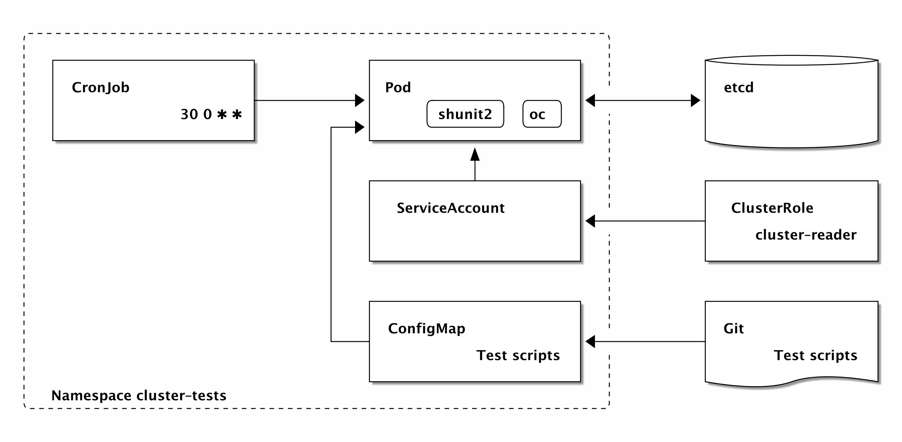

# OpenShift cluster tests



Use `openshift-unit` to test those aspects of your OpenShift cluster that are not already covered by monitoring and health checks. Run tests periodically with read-only access to all projects.

For example, you could assert that:

* the groups `system:authenticated` and `system:authenticated:oauth` must not be given the role `self-provisioner`
* service account `default` must not have security context constraint `anyuid` (ideally the rule would apply to all service accounts) 
* pods in user projects must not run in privileged security context
* and so on

The default set of tests includes the following:
```
test
├── anyuid_test
├── exports
├── limits_test
├── nodes_test
├── privileged_test
└── self_provisioner_test
```

The `exports` file exports variables such as `USER_PROJECTS` and `NODES`, which can then be used and reused freely in tests.

The test pod has `oc`, `curl`, `jq`, `psql` and so on to examine the cluster from within, with `cluster-reader` access. It mounts the test scripts (stored in a ConfigMap) and runs each one in turn.

## Run the tests
```
$ ./oc-create.sh
project "openshift-unit" created
serviceaccount "openshift-unit" created
cronjob "openshift-unit" created
rolebinding "system:deployers" created
deploymentconfig "openshift-unit" created
clusterrolebinding "openshift-unit" created
limitrange "openshift-unit" created
resourcequota "openshift-unit" created
configmap "openshift-unit" created
$ oc get po
NAME                     READY     STATUS    RESTARTS   AGE
openshift-unit-1-bcp2d   1/1       Running   0          4m 
$ oc exec openshift-unit-1-bcp2d openshift-unit
test_project_quotas
test_nodes_ready
test_nodes_no_warnings
test_security_context_privileged
test_anyuid
test_self_provisioner

Ran 6 tests.

OK
```

## Writing your own tests
To add tests, populate the folder `test` with additional files (each containing one or more Bash functions and an instruction to add them to the test suite). To update the ConfigMap, run:
```
$ ./update-configmap.sh
```
This will refresh the configmap from the contents of the `test` folder.

## Cleanup
The script `cleanup.sh` will remove the project `openshift-unit` and the rolebinding that gives the serviceaccount `openshift-unit` read-only access to all projects.

## Building the image
Use the script `docker-build.sh` to create a bespoke test runner image. In many cases, the version of the `oc` client should be adjusted from `latest` to a version that matches your cluster.

Tag the image as desired and upload to Docker Hub or a private registry as appropriate.

## Note on versions
The default image on Docker Hub ships with the current stable build of the `oc` client. You may wish to adjust the version tag in the `docker-build.sh` script and create an image that matches your cluster exactly.

OpenShift versions prior to 3.9 (and Kubernetes versions prior to 1.8) offer limited support for CronJob objects (the version attribute has `v2alpha1`). If a process fails, the v2 alpha CronJob will keep spawning containers until a container returns zero. The problem is exacerbated by the fact that the CronJob object in these OpenShift builds does not recognise the cleanup properties reducing the number of `completed` or `error` pods kept.

To deal with this (and until most OpenShift installations are on 3.9 or higher), the CronJob always returns zero.
